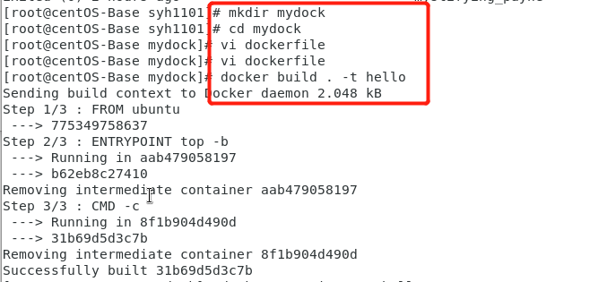

# Docker容器技术学习实验报告

## 准备docker环境
[CentOS安装docker](http://www.cnblogs.com/freefei/p/9263998.html)
### 检查docker安装

### 运行第一个容器


---
## docker基本操作
### 运行镜像

### 显示本地镜像库内容
有我们刚刚运行的ubuntu和helloworld镜像，

### 显示运行中容器


---
## MySQL与容器化
### 拉取MySQL镜像

### 查看本地镜像库


&emsp;在拉取镜像的时候真的超级慢，这里分享一篇加速拉去速度的博客：
[用阿里云加速docker拉取镜像的速度](https://blog.csdn.net/Funny_Ma/article/details/96478395)

[MySQL 容器构建文件 Dockerfile](https://github.com/docker-library/mysql/blob/master/5.7/Dockerfile)

---
## 构建docker镜像练习



### 运行镜像
- 参数说明

>-it：开启交互功能  
--rm 启动的容器在停止后自动删除


### 使用MySQL容器
- 启动服务器


- 启动MySQL客户端

>`sudo docker run -it --rm --net host mysql:5.7 "sh"` 启动了容器内 sh 进程。   
`-it` 等价于 -i -t ，表示使用当前 stdin 和 stdout 作为该进程的 io     
`--rm` , 当该进程结束时，自动清理该容器的文件系统空间  
`--net host`，表示容器使用当前主机的网络环境  
参数1 参数2，分别是镜像和在镜像中执行的命令  
`#`表示你处于容器的超级管理员的 shell  
`mysql -h127.0.0.1 -P3306 -uroot -p123456 mysql` 是客户端的命令


[mysql 客户端基本操作](https://blog.csdn.net/pmlpml/article/details/78602290)

### 挂载卷保存db
#### 数据库文件位置：

- 每次启动 mysql 容器，docker 创建一个文件卷挂载在容器内`/var/lib/mysql`位置  
- 这个卷在主机（host）的 `/var/lib/docker/volumes/` 目录下


- 创建卷并且挂载在`/var/lib/mysql`


- 启动客户端容器链接服务器


客户端容器内可以使用mysql别名服务器

---
## Docker compose 与多容器应用自动化部署

### docker-compose下载
```
下载最新版的`docker-compose`文件 
$ sudo curl -L https://github.com/docker/compose/releases/download/1.16.1/docker-compose-`uname -s`-`uname -m` -o /usr/local/bin/docker-compose
添加可执行权限 
$ sudo chmod +x /usr/local/bin/docker-compose
测试安装结果 
$ docker-compose --version 
docker-compose version 1.16.1, build 1719ceb
```

---
## Docker 网络
### 容器网络

- 备制支持 ifconfig 和 ping 命令的 ubuntu 容器


- 启动另一个命令窗口，由容器制作镜像

 

### 创建自定义网络
 


- 在两个窗口创建 u1,u2 容器网络，并使用以下命令 
```
~]# docker run --name u1 -it -p 8080:80 --net mynet --rm ubuntu:net bash
~]# docker run --name u2 --net mynet -it --rm ubuntu:net bash
~]# docker info u1
~]# docker network connect bridge u1
~]# docker network disconnect mynet u1
```
---
## Docker 仓库

[搭建私有仓库](https://docker.github.io/registry/deploying/)
- Run a local registry启动仓库

 
- Copy an image from Docker Hub to your registry复制镜像到仓库

>拉取Ubuntu：16.04镜像  
为镜像创建一个tag  
将镜像push到仓库  

 
- remove 删除本地镜像文件

 

- Stop a local registry停止仓库运行
```
$ docker container stop registry
```

--- 
## 容器监控与日志
检查docker状态
```
~]# docker info 
… …
~]# docker info --format {{.ServerVersion}}

```

 
- 查看容器内进程
```
~]# docker stats
```
 
- 容器详细信息
```
~]# docker inspect
… …
~]# docker inspect -f '{{.NetworkSettings.IPAddress}}' imageId
172.17.0.3
```

- 容器日志查看

 

--- 
## docker图形化管理工具
- web图形化管理工具Portainer
- 单节点运行

 
- Unix socket
[关于/var/run/docker.sock](http://www.cnblogs.com/fundebug/p/6723464.html)
- 使用 Portainer
[Github](https://github.com/portainer/portainer)
[详细部署](https://portainer.readthedocs.io/en/latest/deployment.html) 

--- 
## Golang 应用容器化

[利用 docker hub 自动构建教程](https://blog.csdn.net/u010246789/article/details/54234217)
