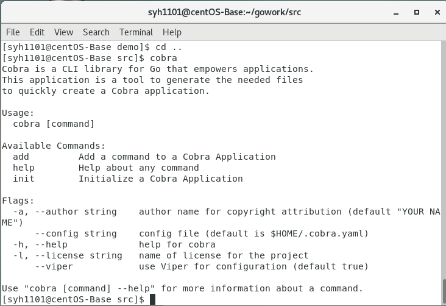
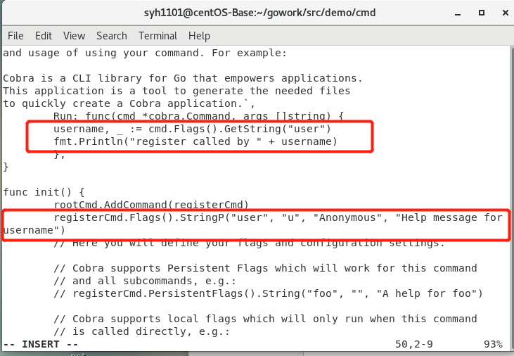
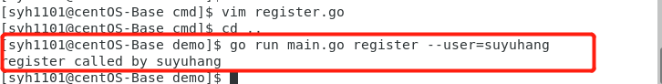
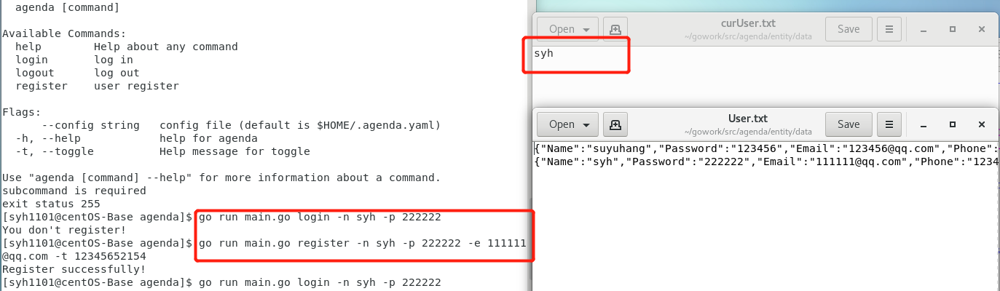
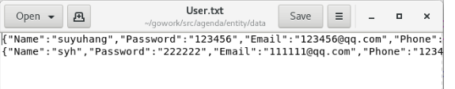
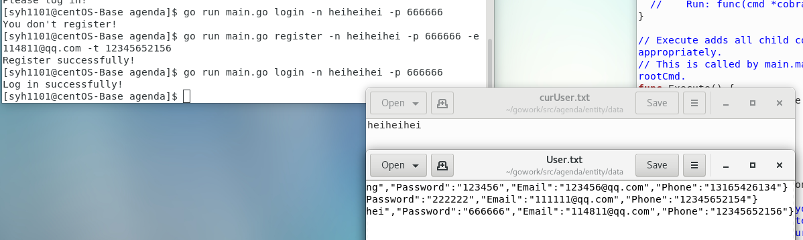
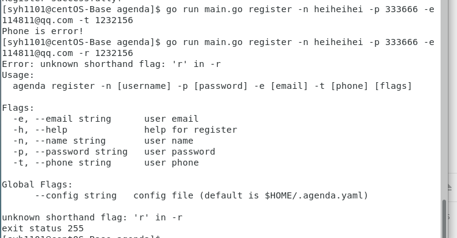

# CLI 命令行实用程序开发实战 - Agenda
*17343102 教务一班 苏禹行*

## 概述
 命令行实用程序并不是都象 cat、more、grep 是简单命令。[go](https://go-zh.org/cmd/go/)项目管理程序，类似 java 项目管理 maven、Nodejs 项目管理程序 npm、git 命令行客户端、 docker 与 kubernetes 容器管理工具等等都是采用了较复杂的命令行。即一个实用程序同时支持多个子命令，每个子命令有各自独立的参数，命令之间可能存在共享的代码或逻辑，同时随着产品的发展，这些命令可能发生功能变化、添加新命令等。因此，符合 [OCP](https://en.wikipedia.org/wiki/Open/closed_principle)原则 的设计是至关重要的编程需求。
  
## 1.任务目标

1.熟悉 go 命令行工具管理项目  
2.综合使用 go 的函数、数据结构与接口，编写一个简单命令行应用 agenda  
3.使用面向对象的思想设计程序，使得程序具有良好的结构命令，并能方便修改、扩展新的命令,不会影响其他命令的代码  
4.项目部署在 Github 上，合适多人协作，特别是代码归并  
5.支持日志（原则上不使用debug调试程序）  

---
### golang知识整理

- [《Go程序设计语言》要点总结——程序结构](http://time-track.cn/gopl-notes-program-structure.html)
- [《Go程序设计语言》要点总结——数据类型](http://time-track.cn/gopl-notes-types.html)
- [《Go程序设计语言》要点总结——函数](http://time-track.cn/gopl-notes-function.html)
- [《Go程序设计语言》要点总结——方法](http://time-track.cn/gopl-notes-function.html)
- [《Go程序设计语言》要点总结——接口](http://time-track.cn/gopl-notes-interface.html)


---

### 安装 cobra

使用命令 `go get -v github.com/spf13/cobra/cobra` 下载过程中，会出提示如下错误
>Fetching https://golang.org/x/sys/unix?go-get=1
>
>https fetch failed: Get https://golang.org/x/sys/unix?go-get=1: dial tcp 216.239.37.1:443: i/o timeout

这是熟悉的错误，请在 `$GOPATH/src/golang.org/x` 目录下用 `git clone` 下载 `sys` 和 `text` 项目，然后使用 `go install github.com/spf13/cobra/cobra`, 安装后在 `$GOBIN` 下出现了 `cobra` 可执行程序。



---

### Cobra 的简单使用

创建一个处理命令 `agenda register -uTestUser` 或 `agenda register --user=TestUser` 的小程序。

简要步骤如下：
>cobra init
>
>cobra add register

需要的文件就产生了。 你需要阅读 `main.go` 的 `main()` ; `root.go` 的 `Execute()`; 最后修改 `register.go`, `init()` 添加：

>registerCmd.Flags().StringP("user", "u", "Anonymous", "Help message for username")

Run 匿名回调函数中添加：

>username, _ := cmd.Flags().GetString("user")
>
>fmt.Println("register called by " + username)

测试命令：
>$ go run main.go register --user=TestUser
>
>register called by TestUser




---
## 2.agenda 开发项目
### 需求描述

- 业务需求：见后面需求

- 功能需求： 设计一组命令完成 agenda 的管理，例如：
>agenda help ：列出命令说明  
>agenda register -uUserName --password pass -email=a@xxx.com ：注册用户  
>agenda help register ：列出 register 命令的描述  
>agenda cm ... : 创建一个会议  
>原则上一个命令对应一个业务功能

- 持久化要求：
>使用 json 存储 User 和 Meeting 实体  
>当前用户信息存储在 curUser.txt 中


- 项目目录
>cmd ：存放命令实现代码
>entity ：存放 User 和 Meeting 对象读写与处理逻辑

- 其他目录 ： 自由添加
- 日志服务
>使用 log 包记录命令执行情况

---

### Agenda 业务需求
本次实验完成了以下需求:
- 用户注册
注册新用户时，用户需设置一个唯一的用户名和一个密码。另外，还需登记邮箱及电话信息。
如果注册时提供的用户名已由其他用户使用，应反馈一个适当的出错信息；成功注册后，亦应反馈一个成功注册的信息。

- 用户登录
用户使用用户名和密码登录 Agenda 系统。
用户名和密码同时正确则登录成功并反馈一个成功登录的信息。否则，登录失败并反馈一个失败登录的信息。

- 用户登出
已登录的用户登出系统后，只能使用用户注册和用户登录功能。


### 命令与参数设计
- register 用户注册
```
$ register -n [username] -p [password] -e [email] -t [phone]
```
- login 用户登录
```
$ login -n  [username] -p [password]
```
-  logout 用户登出
```
$ logout（无参数）
```


### 测试用例

1.登录，不存在用户提示注册，注册之后在`./entity/data/curUser.txt`会出现当前用户


2.注册成功，用户信息存在`./entity/data/User.txt`




3.登录其他账户时`curUser.txt`相应更新


4.一些错误提示：（举例）

- 登录时密码错误：


- 命令格式输入错误：


---

[博客链接](https://blog.csdn.net/Passenger317_/article/details/102780776)

