# 服务计算:CLI 命令行实用程序开发基础
[github链接](https://github.com/syh1101/Service_Computing_homework/tree/master/HW-week4-5)
## 概述
> CLI（Command Line Interface）实用程序是Linux下应用开发的基础。正确的编写命令行程序让应用与操作系统融为一体，通过shell或script使得应用获得最大的灵活性与开发效率。Linux提供了cat、ls、copy等命令与操作系统交互；go语言提供一组实用程序完成从编码、编译、库管理、产品发布全过程支持；容器服务如docker、k8s提供了大量实用程序支撑云服务的开发、部署、监控、访问等管理任务；git、npm等都是大家比较熟悉的工具。尽管操作系统与应用系统服务可视化、图形化，但在开发领域，CLI在编程、调试、运维、管理中提供了图形化程序不可替代的灵活性与效率
## 基础知识
- CLI 实用程序支持工具  
[开发 Linux 命令行实用程序](https://www.ibm.com/developerworks/cn/linux/shell/clutil/index.html)
### pflag 安装与使用
- 安装pflag
```C#
  go get github.com/spf13/pflag
```
- 导入pflag包
```C#
  import (
    ......
	"github.com/spf13/pflag"
  )
```

### selpg程序逻辑  
> selpg 是从文本输入选择页范围的实用程序。该输入可以来自作为最后一个命令行参数指定的文件，在没有给出文件名参数时也可以来自标准输入

### selpg(unix系统下命令)命令格式 

```
selpg -s start_page -e end_page [-l line_per_page | -f ] [-d dstFile] [filename]
```
- -s start_page (开始读取的页号)
- -e end_page (结束读取的页号)
- -l line_per_page (多少行为一页)
- -f (按照分页符 `\f` 分页)
- -d (输出文件路径，选项可接受的打印机名称)

## 程序实现
1. 定义selpgArgs结构体
```C#
type selpgArgs struct {
	startPage  int
	endPage    int
	inFileName string
	pageLength    int
	pageType   bool
	printDest  string
}
```
2. 利用flag参数来解析各个参数,通过下面的代码进行参数值的绑定,通过 pflag.Parse()方法让pflag 对标识和参数进行解析,之后就可以直接使用绑定的值
```C#
func AnalyArgs(args *selpgArgs) {

	pflag.IntVarP(&(args.startPage), "startPage", "s", -1, "Define startPage")
	pflag.IntVarP(&(args.endPage), "endPage", "e", -1, "Define endPage")
	pflag.IntVarP(&(args.pageLength), "pageLength", "l", 72, "Define pageLength")
	pflag.StringVarP(&(args.printDest), "printDest", "d", "", "Define printDest")
	pflag.BoolVarP(&(args.pageType), "pageType", "f", false, "Define pageType")
	pflag.Parse()
	argLeft := pflag.Args()
	if len(argLeft) > 0 {
		args.inFileName = string(argLeft[0])
	} else {
		args.inFileName = ""
	}
}

```
3. 对命令进行参数检查,并输出对应提示
- 检查`args.startPage`和`args.endPage`是否被赋值;
- 检查`args.startPage`和`args.endPage`是否为正数;
- 检查`args.startPage`是否大于`args.endPage`;
- 检查`-l`和`-f`是否同时出现;
- 最后判断`-`l出现时`args.pageLen`是否小于1;
```C#
func checkArgs(args *selpgArgs) {

	if (args.startPage == -1) || (args.endPage == -1) {
		fmt.Fprintf(os.Stderr, "\n[Error]The startPage and endPage can't be empty! \n")
		os.Exit(2)
	} else if (args.startPage <= 0) || (args.endPage <= 0) {
		fmt.Fprintf(os.Stderr, "\n[Error]The startPage and endPage can't be negative! \n")
		os.Exit(3)
	} else if args.startPage > args.endPage {
		fmt.Fprintf(os.Stderr, "\n[Error]The startPage can't be bigger than the endPage! \n")
		os.Exit(4)
	} else if (args.pageType == true) && (args.pageLength != 72) {
		fmt.Fprintf(os.Stderr, "\n[Error]The command -l and -f are confilct! \n")
		os.Exit(5)
	} else if args.pageLength <= 0 {
		fmt.Fprintf(os.Stderr, "\n[Error]The pageLength can't be less than 1 ! \n")
		os.Exit(6)
	} 
}

```
4. 调用excute函数执行命令
- 检查输入
  - 如果没有给定文件名，则从标准输入中获取
  - 如果给出读取的文件名，则调用函数checkFile检查文件是否存在
```C#
func checkfile(filename string) {
	_, errFileExits := os.Stat(filename)
	if os.IsNotExist(errFileExits) {
		fmt.Fprintf(os.Stderr, "\n[Error]: file \"%s\" does not exist\n", filename)
		os.Exit(7)
	}
}
```
5. 命令出现`-d`参数
- 将命令行的输入管道cmd.StdinPipe()获取的指针赋值给fout，然后再将fout返回给`outDes`函数中的作为输出位置参数的输入
[管理子进程标准输入输出参考](https://godoc.org/io#Pipe)
```C#
func cmdExec(printDest string) io.WriteCloser {
	cmd := exec.Command("lp", "-d"+printDest)
	fout, err := cmd.StdinPipe()
	checkError(err, "StdinPipe")
	cmd.Stdout = os.Stdout
	cmd.Stderr = os.Stderr
	errStart := cmd.Start()
	checkError(errStart, "CMD Start")
	return fout
}
```
6. `outDes`函数按照解析的selpg命令要求读取input_file并输出
```C#
func outDes(fout interface{}, fin *os.File, pageStart int, pageEnd int, pageLength int, pageType bool) {

	lineCount := 0
	pageCount := 1
	buf := bufio.NewReader(fin)
	for true {

		var line string
		var err error
		if pageType {
			// command -f
			line, err = buf.ReadString('\f')
			pageCount++
		} else {
			// command  -l
			line, err = buf.ReadString('\n')
			lineCount++
			if lineCount > pageLen {
				pageCount++
				lineCount = 1
			}
		}

		if err == io.EOF {
			break
		}
		checkError(err, "file read in")

		if (pageCount >= pageStart) && (pageCount <= pageEnd) {
			var outputErr error
			if stdOutput, ok := fout.(*os.File); ok {
				_, outputErr = fmt.Fprintf(stdOutput, "%s", line)
			} else if pipeOutput, ok := fout.(io.WriteCloser); ok {
				_, outputErr = pipeOutput.Write([]byte(line))
			} else {
				fmt.Fprintf(os.Stderr, "\n[Error]:fout type error. ")
				os.Exit(8)
			}
			checkError(outputErr, "Error happend when output the pages.")
		}
	}
	if pageCount < pageStart {
		fmt.Fprintf(os.Stderr, "\n[Error]: startPage (%d) greater than total pages (%d), no output written\n", pageStart, pageCount)
		os.Exit(9)
	} else if pageCount < pageEnd {
		fmt.Fprintf(os.Stderr, "\n[Error]: endPage (%d) greater than total pages (%d), less output than expected\n", pageEnd, pageCount)
		os.Exit(10)
	}
}
```
## 测试结果
按照[使用selpg](https://www.ibm.com/developerworks/cn/linux/shell/clutil/index.html)里面的要求进行测试  

> $ selpg -s1 -e1 input_file 

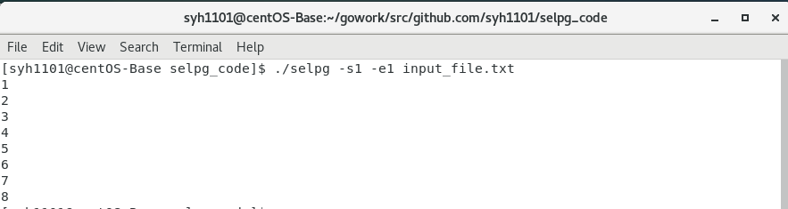  
> $ selpg -s1 -e1 < input_file 

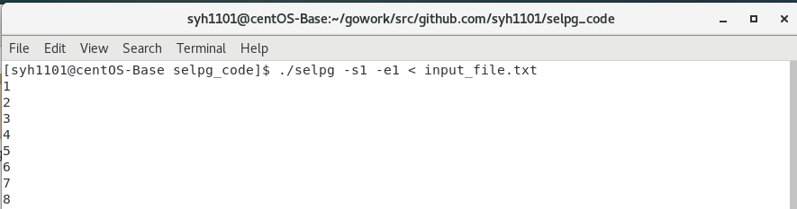  
> $ other_command | selpg -s10 -e20  

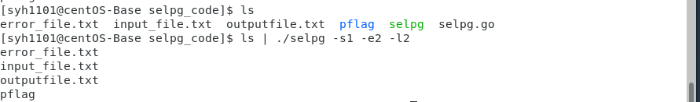  
> $ selpg -s10 -e20 input_file >output_file  

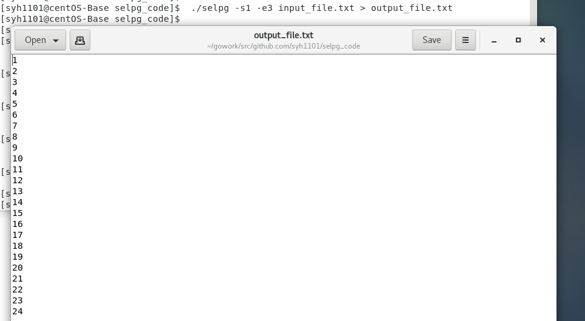  
> $ selpg -s10 -e20 input_file 2>error_file  

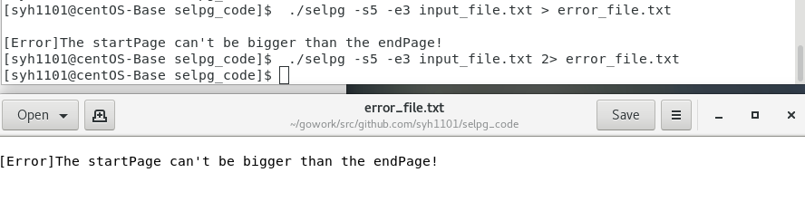  

> $ selpg -s10 -e20 input_file >output_file 2>error_file  

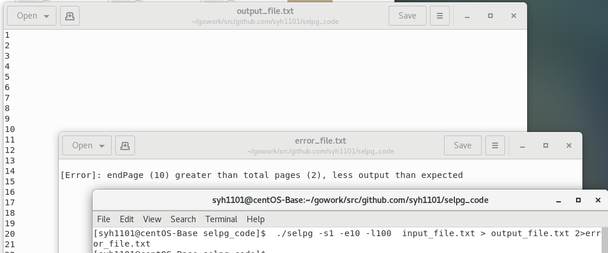  
> $ selpg -s10 -e20 input_file >output_file 2>/dev/null 

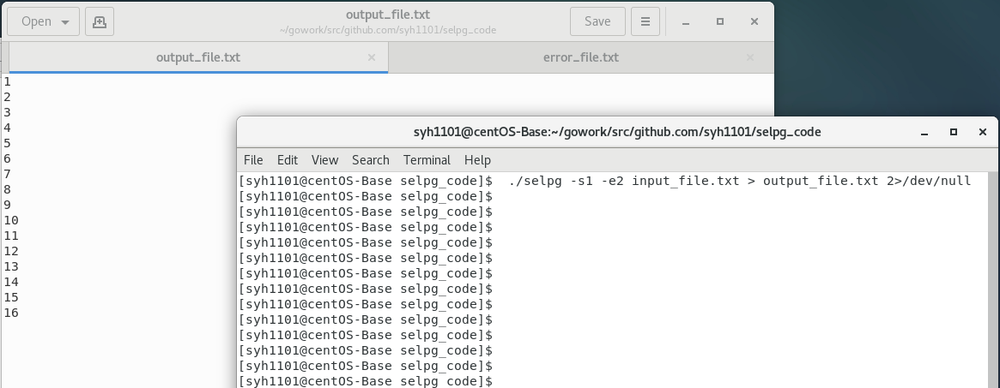  
> $ selpg -s10 -e20 input_file >/dev/null  

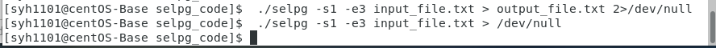  
> $ selpg -s10 -e20 input_file | other_command  

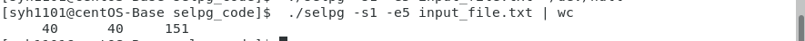  
> $ selpg -s10 -e20 input_file 2>error_file | other_command  

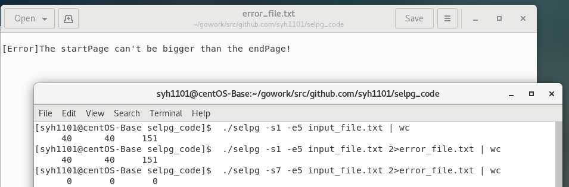  
> $ selpg -s10 -e20 -l66 input_file  

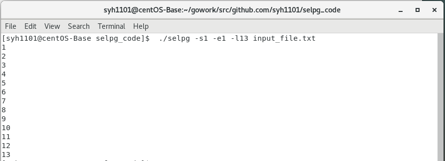  

> $ selpg -s10 -e20 input_file > output_file 2>error_file   

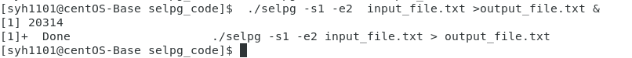   


## 参考资料
[go文件读写](http://wiki.jikexueyuan.com/project/the-way-to-go/12.2.html)   
[os/exec使用-golang](https://blog.csdn.net/chenbaoke/article/details/42556949)  
[bufio包使用](https://www.cnblogs.com/maxiaoyun/p/7007755.html)  
[selpg.c源代码](https://www.ibm.com/developerworks/cn/linux/shell/clutil/selpg.c)
