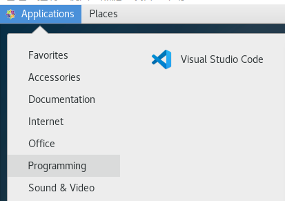
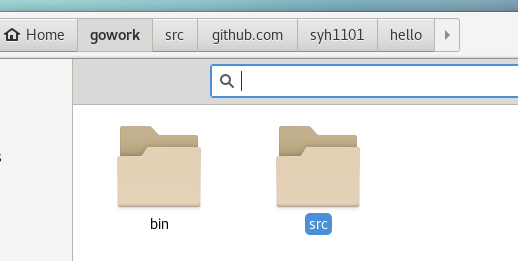
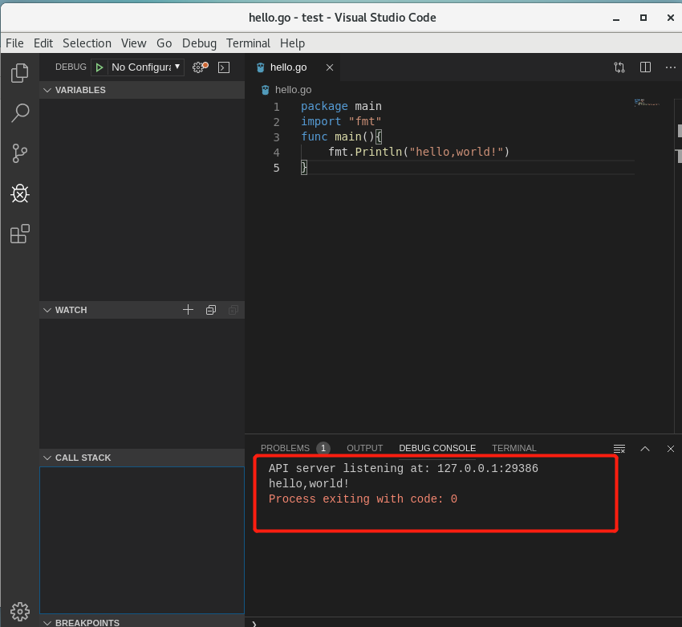

# 安装 go 语言开发环境
## 1、安装 VSCode 编辑器
> Visual Studio Code 是一个轻量级但功能强大的源代码编辑器，可在 Windows，macOS 和 Linux 桌面上运行。它内置了对JavaScript，TypeScript和Node.js的支持，并为其他语言（如C ++，C＃，Java，Python，PHP，Go）和运行时（如.NET和Unity）提供了丰富的扩展生态系统。  

linux 下安装:

* [Running VS Code on Linux](https://code.visualstudio.com/docs/setup/linux)
* 在CentOS里面撞VXcode编辑器，在终端输入命令

> $ sudo rpm --import https://packages.microsoft.com/keys/microsoft.asc  
> $ sudo sh -c 'echo -e "[code]\nname=Visual Studio Code\nbaseurl=https://packages.microsoft.com/yumrepos/vscode\nenabled=1\ngpgcheck=1\ngpgkey=https://packages.microsoft.com/keys/microsoft.asc" > /etc/yum.repos.d/vscode.repo'  

以上是安装密钥和存储库  

> $ yum check-update  
> $ sudo yum install code
* 安装成功   

  
  

## 2、安装 golang

### 2.1 安装
下载[安装包](https://go-zh.org/),但是网站一直无法连接，于是在qq群里面下载了同学上传的安装包
* 解压压缩包并提取到/usr/local目录，在/usr/local/go 中创建GO目录树

```
$ tar -C /usr/local -xzf go1.13.linux-amd64.tar.gz
```
* 将/usr/local/go/bin添加到环境变量  
```
$ export PATHT=$PATH:/usr/local/go/bin
```


[go 语言工作空间](https://go-zh.org/doc/code.html)

## 3.创建工作空间

```
$ mkdir $HOME/gowork
$ mkdir $HOME/gowork/bin
$ mkdir $HOME/gowork/src
```

### 3.1配置的环境变量，在 `/etc/profile` 文件中添加:
* 注意，这里面`GOROOT`是我们安装go的路径

```
export $GOROOT=/usr/local/go
export GOPATH=~/gowork
export PATH=$PATH:$GOPATH/bin
```


* 接着执行这些配置,使环境变量生效

```
$ source /etc/profile
```
  
### 3.2检查配置

```
$ go env  
```


## 3.3 创建 hello world！

- 创建源代码目录

```
$ mkdir $GOPATH/src/github.com/github-user/hello -p
```

- 编辑hello.go
```
$vim hello.go
```
```go
package main

import "fmt"

func main() {
    fmt.Printf("hello, world\n")
}
```

 - 在终端编译运行

```
$ go run github.com/username(syh1101)/hello/hello.go
hello, world
```
  
- 或者使用`go install`命令
```
$ go install github.com/syh1101/hello
$ hello
```


## 4、安装必要的工具和插件

### 4.1 安装 Git 客户端

输入命令：

```
$ sudo yum install git
```


### 4.2 安装 go 的一些工具


**4.1下载源代码到本地**


* 创建文件夹
```
$mkdir $GOPATH/src/golang.org/x/
```
* 下载源码
```
$ go get -d github.com/golang/tools
```
* 行不通！
* git克隆命令获取tools

```
$ git clone https://github.com/golang/tools.git
```

- 将tools复制到`$GOPATH/src/golang.org/x/`文件夹下面
```
$ cp $GOPATH/src/github.com/golang/tools $GOPATH/src/golang.org/x/ -rf
```

**4.2安装工具包**

```
$ go install golang.org/x/tools/go/buildutil
```
其他的包的安装如`dlv`，`goreturns`等方法类似,参考 [获取Golang.org上的Golang Packages](https://github.com/northbright/Notes/blob/master/Golang/china/get-golang-packages-on-golang-org-in-china.md)


- 查看 go 当前工作空间的目录结构，应该和官方文档 [如何使用Go编程](https://go-zh.org/doc/code.html) 的工作空间一致


**4.3安装运行 hello world**

- 在VScode里面直接编译运行  



## 5、安装与运行 go tour

* 细节参见：[《Go 语言之旅》](https://github.com/Go-zh/tour)

```
$ git clone https://github.com/Go-zh/tour/gotour

```
* 在工作空间/gowork/tour下执行go install会在bin文件夹下面得到gotour，但是我们执行的时候就会显示  `github.com/Go-zh/tour/gotour has moved to golang.org/x/tour`

借鉴了另外一篇博客[服务计算-CentOS下安装Go开发环境遇到的一些问题](https://blog.csdn.net/lelouch_matrix/article/details/100690533)在bitbucket上面下载一个gotour,链接如下
> https://bitbucket.org/mikespook/go-tour-zh/downloads/

  
按照博客上面的要求  
```
- 把解压出来的文件夹名改为go-tour-zh,然后移动到$GOPATH/src/bitbucket.org/mikespook/目录下.  
- 在gotour目录下打开终端输入go install然后输入gotour就可以运行了  
```
！遗憾的是还是未能解决  (下载了net也未能解决问题)  


