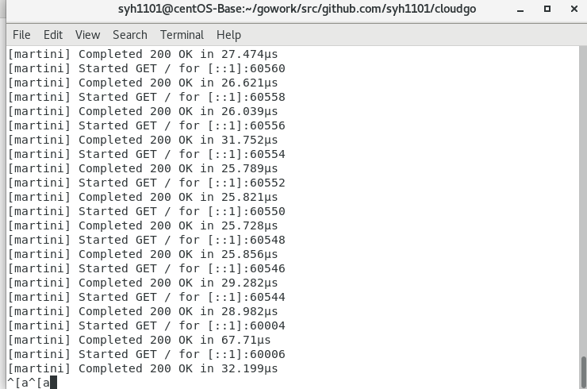

# 开发web服务程序

### 任务目标

- 熟悉 go 服务器工作原理  
- 基于现有 web 库，编写一个简单 web 应用类似 cloudgo。  
- 使用 curl 工具访问 web 程序  
- 对 web 执行压力测试  
- [相关知识](http://blog.csdn.net/pmlpml/article/details/78404838)


### 基本要求
- 编程 web 服务程序 类似 cloudgo 应用 
- 要求有详细的注释  
- 是否使用框架、选哪个框架自己决定 请在 README.md 说明你决策的依据  
- 使用 curl 测试，将测试结果写入 README.md  
- 使用 ab 测试，将测试结果写入 README.md。并解释重要参数  

### 扩展要求  
&emsp;选择简单的库，如 mux 等，通过源码分析、解释它是如何实现扩展的原理，包括一些 golang 程序设计技巧

### 编写简单的cloudgo  
&emsp;**main.go**  

```go
package main
import (
	"os"
	"github.com/syh1101/cloudgo/service"
	flag"github.com/spf13/pflag"
)
const(//默认端口
	PORT string = "8080"
)
func main(){
	port := os.Getenv("PORT")
	if len(port) == 0 {//监听不到端口，默认8080
		port = PORT
	}
	//解析端口
	pPort := flag.StringP("port", "p", PORT, "PORT for httpd listening") 
	flag.Parse()
	if len(*pPort) != 0 {
		port = *pPort
	}
	//启动服务器
	server.NewServer(port) 
}
```
&emsp;我们使用的是Martini框架，Martini框架是使用Go语言作为开发语言的一个强力的快速构建模块化web应用与服务的开发框架，有着极佳的路由匹配和转发，且扩展性强，中间件采用模块化设计  
- **server.go**
```go
package server
import (
    "github.com/go-martini/martini" 
)
func NewServer(port string) {   
    //创建一个martini实例
    m := martini.Classic()
    //请求处理器
    m.Get("/", func() string {
        return "hello world！"
    })
    //创建请求端口
    m.RunOnAddr(":"+port)   
}
```
- 访问`http://localhost:8080/`


- curl测试：


- ab测试：

&emsp;输入命令安装ab：
```
$ yum -y install httpd-tools
```


- 端口的监听情况：


- 重要参数解释： 

>Documents Path：       &emsp;&emsp;//请求的资源  
Documents Length:&emsp;&emsp;//文档返回的长度  

>Concurrency Level:    &emsp;&emsp;  &emsp;&emsp;//并发处理的个数  
Time taken for tests:  &emsp; &emsp;&emsp;//总请求时间  
Complete requests:    &emsp;&emsp;&emsp;  //总请求数  
Failed requests:     &emsp;&emsp;&emsp; &emsp;  //失败的请求数  
Requests per second:  &emsp;  //平均每秒的请求数  
Time per request:     &emsp;&emsp;  //平均每个请求消耗的时间  
Time per request:     &emsp;&emsp;  //上面的请求除以并发数  
Transfer rate:       &emsp; &emsp;&emsp;  //传输速率  

- 吞吐率(`Request per second`)  

&emsp;服务器并发处理能力的量化描述，单位是reqs/s，指的是在某个并发用户数下单位时间内处理的请求数。某个并发用户数下单位时间内能处理的最大请求数，称之为最大吞吐率
- 用户平均请求等待时间(`Time per request`)

&emsp;计算公式：处理完成所有请求数所花费的时间/（总请求数/并发用户数）
- 服务器平均请求等待时间(`Time per request:across all concurrent requests`)

&emsp;计算公式：处理完成所有请求数所花费的时间/总请求数，吞吐率的倒数,也等于用户平均请求等待时间/并发用户数


### 扩展任务
[mux源码分析博客链接](https://blog.csdn.net/Passenger317_/article/details/103016003)